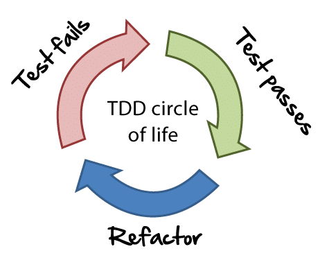

title: TDD for Infrastructure
class: animation-fade
layout: true

<!-- This slide will serve as the base layout for all your slides -->
.bottom-bar[
  {{title}}
]

---

class: impact no-counter

# {{title}}
## Mario Fernandez

---

.quote.huge.space-top[**TDD:** Test Driven Development]

---

.quote.huge.space-top[Part of *Extreme Programming*, started in 1999]

---

# TDD in a nutshell

.col-6[

]

--

.col-6[
1. Write the only the code that is needed
2. Get quick feedback
3. Build a modular design
]
---

class: transition

# You knew that already

---

# Infrastructure as Code

.quote.huge[[IaC](http://infrastructure-as-code.com/) means writing code to manage configurations and automate provisioning]

---

# Infrastructure as Code

.middle.center.space-top[]

---

# How to make sure everything works as expected?

--

.space-top[
### Enter [**ServerSpec**](http://serverspec.org)
.center[]
]

--

.space-top[*ServerSpec* is a tool to write tests for infrastructure based on [RSpec](http://rspec.info/)]

---

class: transition

# Show me the code

---

## Straightforward configuration

```shell-session
spec/spec_helper.rb
```

```ruby
require 'serverspec'
require 'net/ssh'

set :backend, :ssh
host = ENV['TARGET_HOST']

options = Net::SSH::Config.for(host)
set :host,        options[:host_name] || host
set :ssh_options, options

```

---

## Users & Groups

```shell-session
spec/hostname/users_spec.rb
```

```ruby
describe user('travis') do
  it { is_expected.to exist }
  it { is_expected.to belong_to_group 'docker' }
end

describe group('docker') do
  it { is_expected.to exist }
end
```

---

## Files

```shell-session
spec/hostname/files_spec.rb
```

```ruby
  describe file('/vault/file') do
    it { is_expected.to be_directory }
    it { is_expected.to be_owned_by 'vault' }
  end

  describe file('/bin/vault') do
    it { is_expected.to be_executable }
    it { is_expected.to be_owned_by 'root' }
  end
```

---

# And many others

.adjusted[
  
]

---

class: transition

# But wait ...

---

# Isn't this covered by provisioning tools?

.center[

]

---

# Testing Docker images

.docker.middle.center.space-top[

]

---

## A sample Dockerfile

```dockerfile
FROM java-openjdk-build-image as builder

WORKDIR /app
COPY . /app/

RUN gradle assemble

FROM java-openjdk-base-image

ENV PROFILE="in-memory"
COPY --from=builder /app/build/libs/*.jar .
EXPOSE 8080

CMD java -jar -Dspring.profiles.active=${PROFILE} app.jar
```

---


## Basic packages

```ruby
describe 'OpenJDK Image' do
  describe package(:openjdk) do
    it { is_expected.to be_installed }
  end

  describe file("/usr/bin/java") do
    it { is_expected.to be_executable }
  end

  describe command("java -version") do
    its(:stderr) { is_expected.to match(/8.151.12/) }
  end
end
```

---

## Running Application

```ruby
describe 'SpringBoot Applicationn' do
  describe file('/app/application.jar') do
    it { is_expected.to be_file }
  end

  describe process('java') do
    it { is_expected.to be_running }
    its(:args) { is_expected.to match(%r{/app/application.jar}) }
  end

  describe 'port of the app' do
    it { wait_for(port(8080)).to be_listening.with('tcp') }
  end
end
```

---


class: transition

# You can go crazy with this stuff

---

## External dependencies via docker-compose

```ruby
describe 'SpringBoot Application' do
  set :docker_container, 'app-springboot'

  before(:all) do
    compose.up(VAULT_CONTAINER_NAME, detached: true)
    vault.logical.write('secret/app/worspace', foo: :bar)
    compose.up('app-springboot', detached: true)
  end

  describe process('java') do
    it { is_expected.to be_running }
  end
end
```

---

.gif.center[]

---

class: transition

# Summary

---

# ServerSpec

.quote.huge[
*ServerSpec* is a good way to automate the process of testing infrastructure
]

---

# Available backends

- local
- ssh
- Docker
- Even *Windows*

---

# Links

- http://infrastructure-as-code.com/
- http://serverspec.org
- Alternative: https://github.com/aelsabbahy/goss

---

class: impact no-counter

# Thank you
## Questions?

